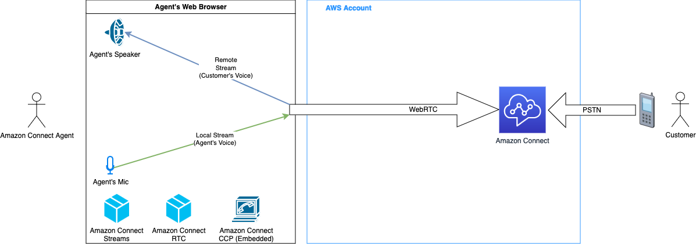
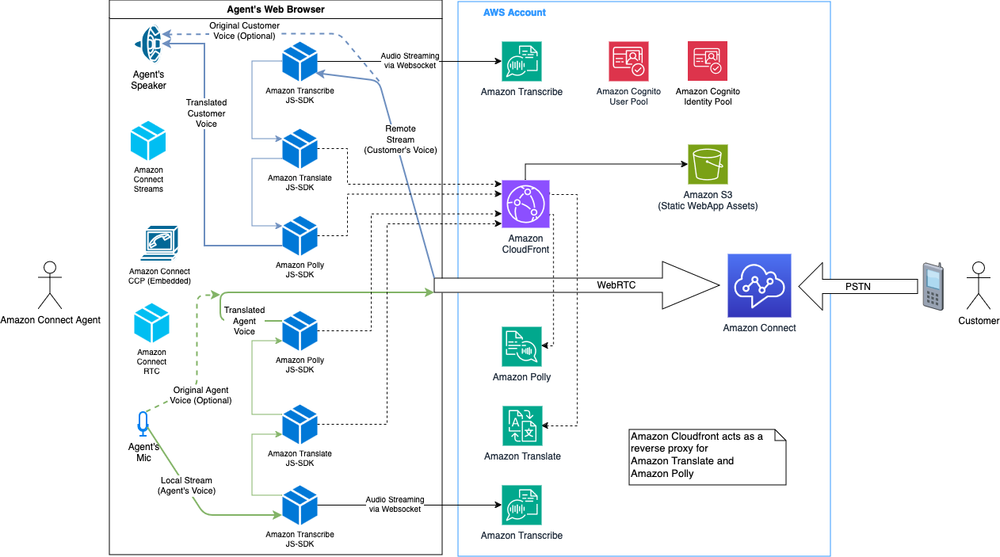
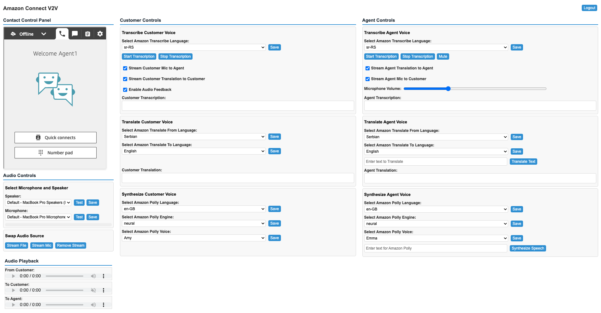
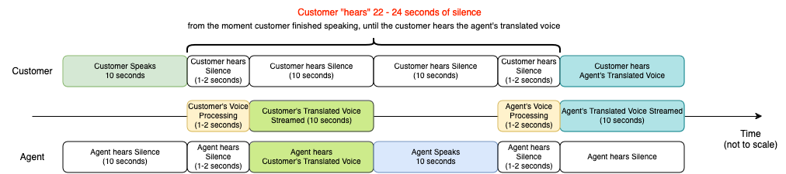
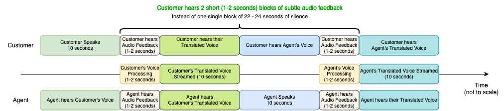

# Amazon Connect Voice to Voice (V2V) Translation

**BE AWARE:** This code base is a sample project designed to provide a demonstration and a base to start from for specific use cases. It's intent is to enable users to define the appropriate customer experience relevant to their business requirements and customer base by providing options to turn on and off specific experiences or adjust volumes independently. It should not be considered Production-ready.

## Use-case scenario

Businesses today face the challenge of providing effective customer support to a diverse global customer base with varying language preferences. Traditional approaches, such as text-based support, third party translation services, and multilingual contact centre agents, often result in suboptimal, inconsistent customer experiences and increased operational costs.

Amazon Connect is an AI-powered application that provides one seamless experience for your contact center customers and users. Customers can leverage the extensibility of Amazon Connect APIs to integrate with other AWS services, such as Amazon Translate, to enable an optimized agent and unified customer experience across text based communications, such as chat and SMS, with easy extensibility to the email channel. The final frontier in true omni-channel translation capabilities has been voice.

The Voice to Voice translation sample project leverages advanced speech recognition and machine translation technologies to enable near real-time translation of voice conversations between agents and customers. By using this sample project as a starter, businesses can develop an Amazon Connect powered solution allowing agents to communicate with customers in their preferred languages without the need for language proficiency or additional staffing.

## Here's a high-level overview of how the solution works:

1. Speech Recognition: The customer's spoken language is captured and converted into text using speech recognition technology. This text is then fed into the machine translation engine.
2. Machine Translation: The machine translation engine translates the customer's text into the agent's preferred language in near real-time. The translated text is then converted back into speech using text-to-speech synthesis.
3. Bidirectional Translation: The process is reversed for the agent's response, translating their speech into the customer's language and delivering the translated audio to the customer.
4. Seamless Integration: The Voice to Voice translation sample project integrates with Amazon Connect, enabling agents to handle customer interactions in multiple languages without any additional effort or training, using the below libraries:
   - [**Amazon Connect Streams JS**](https://github.com/amazon-connect/amazon-connect-streams):
     - Integrate your existing web applications with Amazon Connect
     - Embed Contact Control Panel (CCP) into a web page
     - Use the default built-in interface, or build your own from scratch
   - [**Amazon Connect RTC JS**](https://github.com/aws/connect-rtc-js):
     - Provides softphone support to Amazon Connect
     - Implements Amazon Connect WebRTC protocol and integrates with browser WebRTC APIs
     - Simple contact session interface which can be integrated with Amazon Connect Streams JS
     - In a typical Amazon Connect Streams JS integration, Amazon Connect RTC JS is not required
     - In this sample project, Amazon Connect RTC JS provides access to Amazon Connect WebRTC Media Streams
   - These 2 libraries are imported into Demo Webapp, without any modifications/customisations.

### Key limitations

- This is a sample project and it's not meant to be used in production environment(s)
- Webapp Authentication is implemented via simple redirect to Amazon Cognito Managed Login Page(s)
- For demo purposes, SSO/SAML federation with Amazon Cognito is not supported
- For demo purposes, Amazon Cognito and Amazon Connect are not integrated
- For demo purposes, Amazon Cognito User Pool and Identity Pool credentials are stored in browser's local storage (can be vulnerable to cross-site scripting (XSS) attacks)
- Both Agent Audio and Customer Audio are transcribed locally (agent's browser opening 2 websocket connections to Amazon Transcribe), therefore agent PC performance and network bandwidth need to be checked
- The demo Webapp provides a full control on Voice to Voice setup (i.e. selecting From and To languages, Amazon Polly voices, etc). These parameters would normally be set based on Amazon Connect Contact Attributes
- The sample project has not been tested with outbound calls, conference or transfers
- The sample project has not been tested in combination with other channels, such as chat, tasks, email
- When configuring regions for Amazon Transcribe/Translate/Polly, select a region that is closer to your agents (Amazon Connect instance can be in a different region)

## Solution architecture:

### Typical Amazon Connect CCP embedded to a custom webapp

### Amazon Connect Voice 2 Voice architecture:

## Solution components

On a high-level, the solution consists of the following components, each contained in these folders:

- **webapp** - Demo Web Application
- **cdk-stacks** - AWS CDK stacks:
  - `cdk-backend-stack` with all the backend resources needed for the solution (Amazon Cognito, etc)
  - `cdk-front-end-stack` with front-end resources for hosting the webapp (Amazon S3, Amazon CloudFront distribution)

## Solution prerequisites

- AWS Account
- [AWS IAM user](https://docs.aws.amazon.com/IAM/latest/UserGuide/id_users_create.html) with Administrator permissions
- Amazon Connect instance
- [Node](https://nodejs.org/) (v20) and [NPM](https://docs.npmjs.com/downloading-and-installing-node-js-and-npm) (v10) installed and configured on your computer
- [AWS CLI](https://docs.aws.amazon.com/cli/latest/userguide/cli-chap-getting-started.html) (v2) installed and configured on your computer
- [AWS CDK](https://docs.aws.amazon.com/cdk/v2/guide/getting_started.html) (v2) installed and configured on your computer

## Solution setup

The below instructions show how to deploy the solution using AWS CDK CLI. If you are using a Windows device please use the [Git BASH](https://gitforwindows.org/) terminal and use alternative commands where highlighted.

These instructions assume you have completed all the prerequisites, and you have an existing Amazon Connect instance.

1. Clone the solution to your computer (using `git clone`)

2. Check AWS CLI

   - AWS CDK will use AWS CLI local credentials and region
   - check your AWS CLI configuration by running an AWS CLI command (e.g. `aws s3 ls`)
   - you can also use profiles (i.e. `export AWS_PROFILE=<<yourProfile>>`)
   - you can confirm the configured region with  
     `aws ec2 describe-availability-zones --output text --query 'AvailabilityZones[0].[RegionName]'`

3. Install NPM packages

   - Open your Terminal and navigate to `connect-v2v-translation-with-cx-options/cdk-stacks`
   - Run `npm run install:all`
   - This script goes through all packages of the solution and installs necessary modules (webapp, cdk-stacks)

4. Configure CDK stacks

   - In your terminal, navigate to `connect-v2v-translation-with-cx-options/cdk-stacks`
   - To see the full instructions for the configuration script, run  
     `npm run configure:help`
   - For the purpose of this guide, start the configuration script in interactive mode which will guide you through each input one at a time.
     (Note, it is possible to configure it via single command, by directly providing parameters, as described in the script help instructions)

     `npm run configure`

   - When prompted, provide the following parameters:
     - `cognito-domain-prefix`: Amazon Cognito hosted UI domain prefix, where users will be redirected during the login process. The domain prefix has to be unique, and you could put your Amazon Connect Instance Alias to it. For example: connect-v2v-instance-alias
     - `cognito-callback-urls`: Please provide a callback URL for the Amazon Cognito authorization server to call after users are authenticated. For now, set it as `https://localhost:5173`, we will come back to it once our front-end is deployed.
     - `cognito-logout-urls`: Please provide a logout URL where user is to be redirected after logging out. For now, set it as `https://localhost:5173`, we will come back to it once our front-end is deployed.
     - `connect-instance-url`: Amazon Connect instance URL that solution will use. For example: `https://connect-instance-alias.my.connect.aws` (or `https://connect-instance-alias.awsapps.com`)
     - `connect-instance-region`: Amazon Connect instance Region that solution will use. For example: us-east-1
     - `transcribe-region`: Amazon Transcribe Region that solution will use. For example: us-east-1
     - `translate-region`: Amazon Translate Region that solution will use. For example: us-east-1
     - `translate-proxy-enabled`: When enabled, webapp requests to Amazon Translate are proxied through Amazon Cloudfront (recommended to avoid CORS)
     - `polly-region`: Amazon Polly Region that solution will use. For example: us-east-1
     - `polly-proxy-enabled`: When enabled, webapp requests to Amazon Polly are proxied through Amazon Cloudfront (recommended to avoid CORS)

5. Deploy CDK stacks

   - In your terminal, navigate to navigate to `connect-v2v-translation-with-cx-options/cdk-stacks`
   - Run the script: `npm run build:webapp` (remember to complete this step whenever you want to deploy new front end changes)
     - **On Windows devices use `npm run build:webapp:gitbash`**.
   - This script builds frontend applications (webapp)
   - If you have started with a new environment, please bootstrap CDK: `cdk bootstrap`
   - Run the script: `npm run cdk:deploy`
     - **On Windows devices use `npm run cdk:deploy:gitbash`**.
   - This script deploys CDK stacks
   - Wait for all resources to be provisioned before continuing to the next step
   - AWS CDK output will be provided in your Terminal. You should see the Amazon Cognito User Pool Id as `userPoolId` from your Backend stack,
     and Amazon CloudFront Distribution URL as `webAppURL` from your Frontend stack.
     **Save these values as you will be using them in the next few steps.**

6. Configure Amazon Connect Approved Origins

- Login into your AWS Console
- Navigate to Amazon Connect -> Your instance alias -> Approved origins
- Click **Add Domain**
- Enter the domain of your web application, in this case Amazon CloudFront Distribution URL. For instance: `https://aaaabbbbcccc.cloudfront.net`
- Click **Add Domain**

7. Create Cognito User

   - To create an Amazon Cognito user, you'll need Cognito User Pool Id (created in step 5 - check for the AWS CDK Output, or check it in your AWS Console > Cognito User Pools)
   - Create an Amazon Cognito user either user directly in the [Cognito Console](https://docs.aws.amazon.com/cognito/latest/developerguide/how-to-create-user-accounts.html#creating-a-new-user-using-the-users-tab) or by executing:
     `aws cognito-idp admin-create-user --region <<yourDesiredRegion>> --user-pool-id <<yourUserPoolId>>  --username <<yourEmailAddress>> --user-attributes "Name=name,Value=<<YourName>>" --desired-delivery-mediums EMAIL`
   - You will receive an email, with a temporary password, which you will need in step 7
     **You can repeat this step for each person you want to give access to either now or at a later date.**

8. Configure Cognito Callback and Logout URLs

   - In your terminal, navigate to `connect-v2v-translation-with-cx-options/cdk-stacks`
   - Start the configuration script in interactive mode  
     `npm run configure`
   - The script loads all the existing parameters, and prompts for new parameters to be provided
   - Accept all the existing parameters, but provide a new value for:
     - `cognito-callback-urls`: Domain of your web application, in this case Amazon CloudFront Distribution URL. For instance: `https://aaaabbbbcccc.cloudfront.net`
     - `cognito-logout-urls`: Domain of your web application, in this case Amazon CloudFront Distribution URL. For instance: `https://aaaabbbbcccc.cloudfront.net`
     - For the Demo / Development purposes, you can configure both the previously entered `https://localhost:5173` and Amazon CloudFront Distribution URL (comma separated)
   - The script stores the deployment parameters to AWS System Manager Parameter Store
   - While in `connect-v2v-translation-with-cx-options/cdk-stacks`, run the deploy script: `npm run cdk:deploy`
     - **On Windows devices use `npm run cdk:deploy:gitbash`**.
   - Wait for the CDK stacks to be updated

9. Test the solution
   - Open your browser and navigate to Amazon CloudFront Distribution URL (Output to the console and also available in the Outputs of the Frontend Cloudformation Stack)
   - On the Cognito Login screen, provide your email address and temporary password you received via email
   - If logging in the first time you will be prompted to reset your password.
   - If not already logged in Amazon Connect CCP, you will need to provide your Amazon Connect Agent username and password (For Demo purposes, Amazon Cognito and Amazon Connect are not integrated)
   - You should now see Amazon Connect CCP and Voice to Voice (V2V) controls
   - To proceed with the demo, please check the **Custom UI Demo Guide** section

## Test Webapp locally

To be able to make changes in the Webapp and test them locally, without re-deploying the Webapp to Amazon CloudFront, please follow these steps:

1. In your terminal, navigate to `connect-v2v-translation-with-cx-options/cdk-stacks`
2. Synchronise the Webapp config parameters: `npm run sync-config`
3. This script will download `frontend-config.js` to the `webapp` folder
4. In your terminal, navigate to `connect-v2v-translation-with-cx-options/webapp`
5. To start the Webapp: `npm run dev`
6. This script starts a local Vite server on port 5173
7. Open your browser and navigate to `https://localhost:5173`
8. You can make changes and customize Webapp files, with browser automatically reloading the Webapp
9. Please make sure you add `https://localhost:5173` as Amazon Connect Approved Origin (see Step 6 in **Solution setup** -> **Configure Amazon Connect Approved Origins**)
10. Once happy with the changes, navigate to `connect-v2v-translation-with-cx-options/cdk-stacks` and `npm run build:deploy:all` (On Windows devices use `npm run build:deploy:all:gitbash`)

## Clean up

To remove the solution from your account, please follow these steps:

1. Remove CDK Stacks

   - Run `cdk destroy --all`

2. Remove deployment parameters from AWS System Manager Parameter Store
   - Run `npm run configure:delete`

## Custom UI Demo Guide

**Important:** In the Audio Controls panel, select the microphone and speaker device that you use to engage with customer voice calls in Amazon Connect.

**Note:** For demo purposes, you can also test different streaming behaviors that influence the customer experience:

- **Stream File** - only streams a pre-recorded file to the customer (could be used if there was a technical issue, or to greet the customer while the agent gets ready)
- **Stream Mic** - only streams the actual agent microphone to the customer (the default behaviour)
- **Remove Audio Stream** - acts as a mute button, by removing the current audio stream (file / mic / translated voice)

**The user interface consists of three sections:**

1. The Amazon Connect CCP (framed softphone client)
2. The Customer to Agent interaction controls (Transcribe Customer Voice, Translate Customer Voice, Synthesize Customer Voice)
3. The Agent to Customer interaction controls (Transcribe Agent Voice, Translate Agent Voice, Synthesize Agent Voice)

Before placing an incoming call, configure the following:

- In the **Customer Controls** panel, under **Transcribe Customer Voice**:

  - Select the language being spoken by the customer (can be pre-configured for demo purposes)
  - Click "Save"
  - Check "Stream Customer Mic to Agent" to allow agent to hear customer's original voice
  - Check "Stream Customer Translation to Customer" to allow customer to hear their translated speech
  - Check "Enable Audio Feedback" to enable streaming of pre-recorded "contact center background noise" (at a very low volume, and automatically muted when agent reply is being delivered to customer).
  - These options are recommended for a more natural conversation experience (see **Audio Streaming Add-Ons** section)

- In the **Customer Controls** panel, under **Translate Customer Voice**:

  - Select Amazon Translate **From** Language: the customer's native language
  - Select Amazon Translate **To** Language: the agent's native language
  - Click "Save" for each selection

- In the **Customer Controls** panel, under **Synthesize Customer Voice**:

  - Select Amazon Polly Language: the agent's native language
  - Select Amazon Polly Engine: standard, neural, or generative
  - Select Amazon Polly Voice that is going to be used to synthesize customer's translated speech
  - Click "Save" for each selection

- In the **Agent Controls** panel, under: **Transcribe Agent Voice**:

  - Select the language being spoken by the agent (can be pre-configured and saved based on the agent's preference)
  - Click "Save"
  - Check "Stream Agent Translation to Agent" to allow agent to hear their translated speech
  - Check "Stream Agent Mic to Customer" to allow customer to hear agent's original voice (use the slider to adjust Microphone Volume)
  - These options are recommended for a more natural conversation experience (see **Audio Streaming Add-Ons** section)

- In the **Agent Controls** panel, under: **Translate Agent Voice**:

  - Select Amazon Translate **From** Language: the agent's native language
  - Select Amazon Translate **To** Language: the customer's native language
  - Click "Save" for each selection

- In the **Agent Controls** panel, under: **Synthesize Agent Voice**:
  - Select Amazon Polly Language: the customer's native language
  - Select Amazon Polly Engine: standard, neural, or generative
  - Select Amazon Polly Voice that is going to be used to synthesize agents's translated speech
  - Click "Save" for each selection

Once all parameters are configured, place an incoming call to your Amazon Connect instance, and follow the steps:

- Answer the incoming customer call using the embedded softphone client (Amazon Connect CCP)
- In the **Customer Controls** panel, under **Transcribe Customer Voice**, click "Start Transcription" to start transcribing customer's voice
- In the **Agent Controls** panel, under: **Transcribe Agent Voice**, click "Start Transcription" to start transcribing agent's voice

**Note:**
For demo purposes, at the bottom of the screen, there are 3 Audio elements. Those audio elements would normally be hidden in a production environment.

1. **From Customer** - customer's actual voice, at a lower volume (if "Stream Customer Mic to Agent" checked)
2. **To Customer** - audio stream that customer hears (muted for the agent), which includes:
   - translated and synthesized agent's speech
   - agent's actual voice, at a lower volume (if "Stream Agent Mic to Customer" checked)
   - translated and synthesized customer's speech, at a lower volume (if "Stream Customer Translation to Customer" checked)
   - contact center background noise (if "Enable Audio Feedback" checked)
3. **To Agent** - audio stream that agent hears, which includes:
   - translated and synthesized customer's speech
   - translated and synthesized agent's speech, at a lower volume (if "Stream Agent Translation to Agent" checked)
   - contact center background noise (if "Enable Audio Feedback" checked)

## Audio Streaming Add-Ons

Amazon Connect V2V sample project was designed to minimise the audio processing time from the moment customer/agent finishes speaking until the translated audio stream is started. However, the customer/agent experience still doesn't match the experience of a real conversation when both are speaking the same language. This is due to the specific pattern of customer only hearing agent's translated speech, while agent only hearing customer's translated speech. The following diagram displays that pattern:

As displayed on the diagram:

- Customer starts speaking in their own language, and speak for 10 seconds
- Because agent would only hear customer's translated speech, the agent "hears" 10 seconds of silence
- Once customer finishes (their sentence), the audio processing time takes between 1 and 2 seconds, during which both customer and agent "hears" silence
- The customer's translated speech is then streamed to the agent. During that time, the customer "hears" silence
- Once customer's translated speech playback is completed, the agent starts speaking, and speaks for 10 seconds
- Because customer would only hear agent's translated speech, the customer "hears" 10 seconds of silence
- Once agent finishes (their sentence), the audio processing time takes between 1 and 2 seconds, during which both customer and agent "hears" silence
- The agent's translated speech is then streamed to the agent. During that time, the agent "hears" silence

In this scenario, the customer "hears" a single block of 22 to 24 seconds of a complete silence, from the moment the customer finished speaking, until the customer hears the agent's translated voice. This creates a suboptimal experience, since the customer is not really sure what is happening during these 22 to 24 seconds, for instance, have the agent heard them or if there was a technical issue.

To optimise the customer/agent experience, Amazon Connect V2V sample project implements "Audio Streaming Add-Ons", to simulate a more natural conversation experience. In a face-to-face conversation scenario, between two persons who do not speak the same language, we normally have another person "in the middle", a Translator. In this scenario:

- Person_A speaks in their own language, which is heard both by Person_B and the Translator
- The Translator then translates to the Person_B's language. The translation is heard by both Person_B and Person_A
- Essentially, Person_A and Person_B both hear each other speaking their own language, and they hear the translation (from the Translator). There's no "waiting in silence" moment, which is even more important in non face-to-face conversation.

Amazon Connect V2V sample project implementation of the above is displayed on the following diagram:

As displayed on the diagram:

- Customer starts speaking in their own language, and speaks for 10 seconds
- The agent hears the customer's original voice, at a lower volume ("Stream Customer Mic to Agent" checked)
- Once customer finishes (their sentence), the audio processing time takes between 1 and 2 seconds. During that time, both customer and agent hear a subtle audio feedback - "contact center background noise", at a very low volume ("Enable Audio Feedback" checked)
- The customer's translated speech is then streamed to the agent. During that time, the customer hears their translated speech, at a lower volume ("Stream Customer Translation to Customer" checked)
- Once customer's translated speech playback is completed, the agent starts speaking, and speaks for 10 seconds
- The customer hears the agent's original voice, at a lower volume ("Stream Agent Mic to Customer" checked)
- Once agent finishes (their sentence), the audio processing time takes between 1 and 2 seconds. During that time both customer and agent hear a subtle audio feedback - "contact center background noise", at a very low volume ("Enable Audio Feedback" checked)
- The agent's translated speech is then streamed to the agent. During that time, the agent hears their translated speech, at a lower volume ("Stream Agent Translation to Agent" checked)

In this scenario, the customer hears 2 short blocks (1 to 2 seconds) of a subtle audio feedback, instead of 1 single block of 22 to 24 seconds of a complete silence. This pattern is much closed to the real face-to-face conversation that includes a translator. Besides that, there is a couple of more benefits of using the "Audio Streaming Add-Ons" feature:

- In case when the agent/customer only hear their translated and synthesized speech, the actual voice characteristics are lost. For instance, the agent cannot hear if the customer was talking slow, or fast, if the customer was upset, or calm etc. The translated and synthesized speech does not carry over that information.
- In case when call recording is enabled, only customer's original voice and only agent's synthesized speech would be recorded, since the translation and the synthetization is done on the agent (client) side. This makes it difficult for QA teams to properly evaluate and/or audit the conversations, including a lot of silent blocks within it. Instead, when "Audio Streaming Add-Ons" are enabled, there are no silent blocks, and the QA team could hear agent's original voice, customer's original voice, and their respective translated and synthesized speech, all in a single audio file.
- Having both original and translated speech are available in the call recording, makes it easier to detect specific words that would benefit of improve transcription accuracy (by using Amazon Transcribe Custom vocabularies), and/or translation accuracy (using Amazon Translate custom terminologies), to make sure that your brand names, character names, model names, and other unique content get transcribed and translated to the desired result.

## Demo Webapp key components

- **Adapters** - allow communication with AWS Services, abstracting AWS SDK specifics from the application business logic:
  - **Transcribe Adapter** - allows Amazon Transcribe client to be reused across requests, and provides provides separate Amazon Transcribe clients for agent's and customer's audio transcription
  - **Polly Adapter** - allows Amazon Polly client to be reused across requests, and allows Amazon CloudFront to act as a reverse proxy for Amazon Polly
  - **Translate Adapter** - allows Amazon Translate client to be reused across requests and allows Amazon CloudFront to act as a reverse proxy for Amazon Translate
- **Managers** - abstracts audio streaming specifics from the application business logic:
  - **Audio Stream Manager** - allows simple management and mixing of different audio streams, such as file, mic, translated voice etc.
    - `ToCustomerAudioStreamManager` is attached to **To Customer** audio element and controls what customer hears
    - `ToAgentAudioStreamManager` is attached to **To Agent** audio element and controls what agent hears
  - **Session Track Manager** - abstracts Amazon Connect WebRTC Media Streaming management
    - uses Amazon Connect SoftphoneManager (from Amazon Connect Streams JS / Amazon Connect RTC JS)
    - to set/replace current audio track in the currently active WebRTC PeerConnection

## Security

See [CONTRIBUTING](CONTRIBUTING.md#security-issue-notifications) for more information.

## License

This library is licensed under the MIT-0 License. See the LICENSE file.
